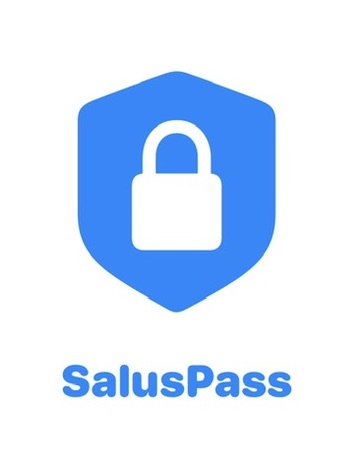
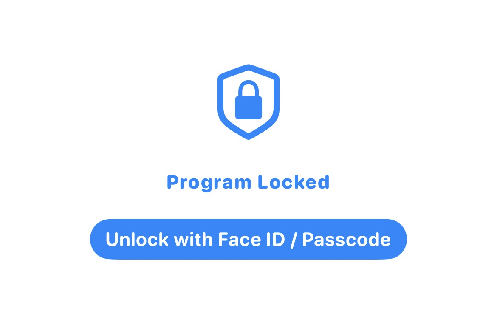
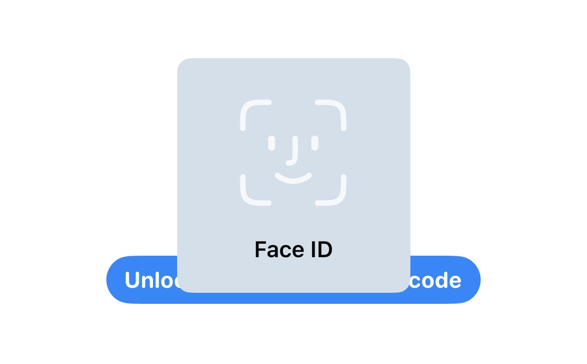
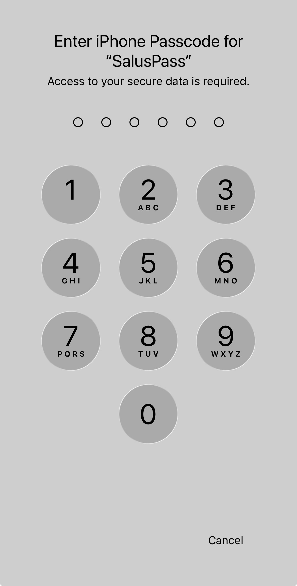
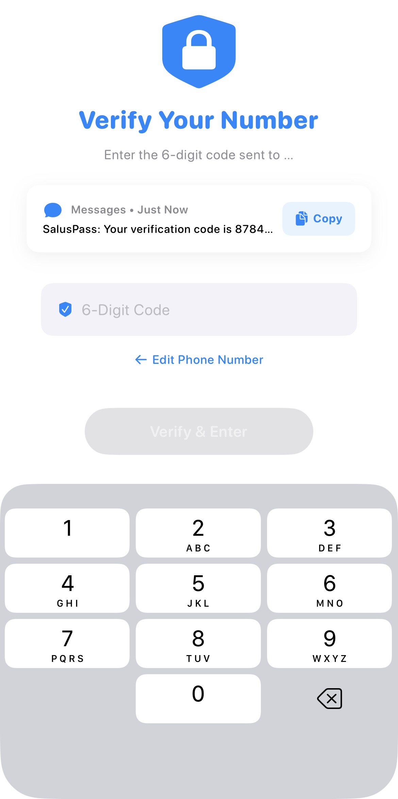
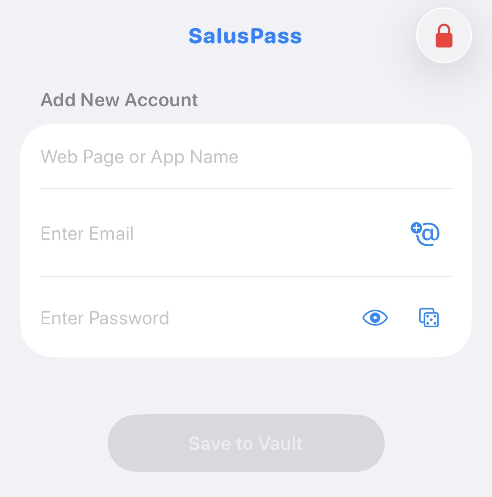
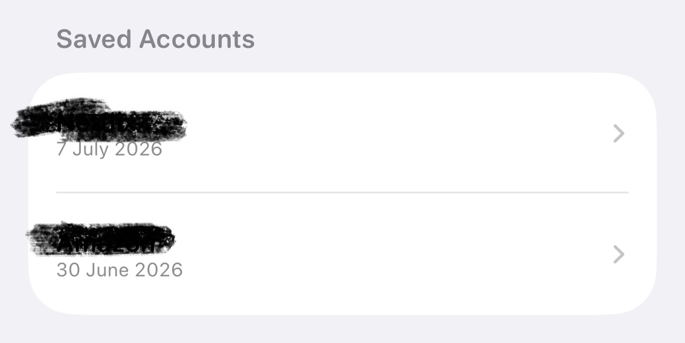
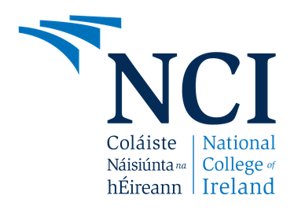

# SalusPass

    

This is a program that will create temporary email accounts for users that have or are on the verge of being hacked to not only protect their account but to allow them to keep using it along it including linking your phone number to the account. It will also save the passwords and emails in a database for future uses.

    

The way to run this program is by connecting your iPhone to the computer. If you're using a MagSafe charger, you have to use your Mobile Hotspot via the iPhone and the MacBook to get it to work.

    
    
    
    

There are three ways to enter into the main menu of the program, the first is via Face ID, the second is via Passcode and the third option is via an SMS code that will be sent to your phone number.

    
    

To make an account either type in a website or pick from the various app options available, to create an email click the at symbol on the right of the textbox and it will give you the option to generate a new email. And when you want to make a new account there will a list of the previous emails that were made.

There are two ways to make passwords, one is via the iCloud make secure password option and the other is to click the die on the far right side of the textbox and it will give you a random password and you can view what the password by pressing the eye symbol on the left hand side of the die symbol.

    

After you save an account to the vault it will give you a description of what app or website it's targeted to and what date it was added.

    
    

When you want to see the details of the email and password, you can click on the account and then use face id to reveal the data.

To exit the main menu to go back to the lock screen simply press the red lock symbol on the right hand corner.

    
    
    

This project is for National College Of Ireland and it is named after Salus the Roman Goddess of safety and well-being and it is made with XCode.

Last updated: July 8th 2026.
